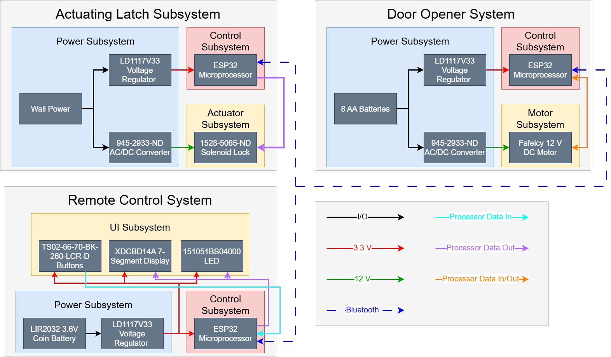
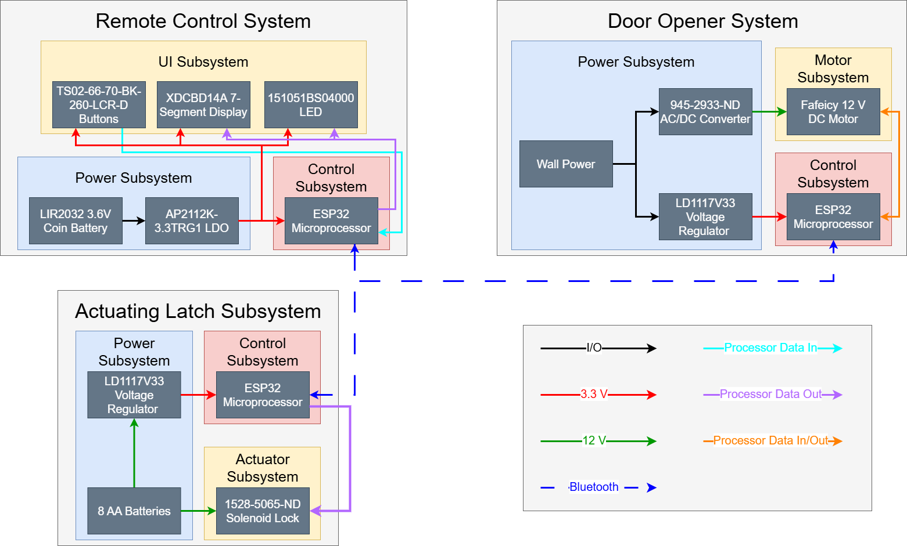
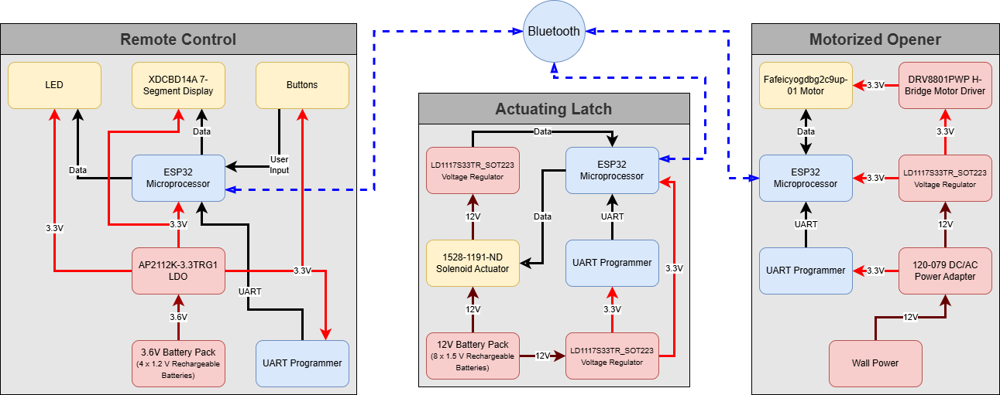

# Alex's Notebook
- [02/11/2025: First Meeting with TA](02/11/2025:-First-TA-Meeting)
- [02/13/2025: Finishing the Proposal](02/13/2025:-Finishing-the-Proposal)
- [02/19/2025: Proposal Review](02/19/2025:-Proposal-Review)
- [02/24/2025: Block Diagram & Part Updates](02/24/2025:-Block-Diagram-&-Part-Updates)
- [02/28/2025: PCB Review](02/28/2025: PCB Review)
- [03/04/2025: TA Meeting](03/04/2025: TA Meeting)
- [03/06/2025: Finishing the Design Doc](03/06/2025: Finishing the Design Doc)
- [03/11/2025: Breadboard Demo](03/11/2025: Breadboard Demo)
- [03/12/2025 to 04/05/2025: Soldering Work](03/12/2025 to 04/05/2025: Soldering Work)
- [04/06/2025: Remote Control PCB Redesign](04/06/2025: Remote Control PCB Redesign)
- [04/08/2025: TA Meeting](04/08/2025: TA Meeting)
- [04/09/2025 to 04/21/25: PCB Work](04/09/2025 to 04/21/25: PCB Work)
- [04/22/2025: Mock Demo](04/22/2025: Mock Demo)
- [04/23/2025 to 04/29/25: Final Fixes](04/23/2025 to 04/29/25: Final Fixes)
- [04/30/2025: Final Demo](04/30/2025: Final Demo)

# 02/11/2025: First TA Meeting
We met with our TA, Chi Zhang to discuss the first draft of our proposal. The main notes we came out of the meeting with was that we need to figure out how to demo our project, we need to quantify all of our requirements, and we need to label the parts on our block diagram. I emailed our assigned professor, Viktor Gruev, and we determined that it was alright to demo using a scaled down model instead of an actual door. For our requirements, Love, Romeo, and I determined quantifiable goals which were mostly latency requirements and operating ranges for the motor. As part of this, we also research and selected specific parts to meet our requirements.

# 02/13/2025: Finishing the Proposal
While I was at work, Love and Romeo went to the machine shop and figured out that Greg could supply us a small door to demo with. Greg also suggested some parts that could work for the door. Once I got home, we used Greg's suggestions and more research to determine the part numbers for our actuator, batteries, motor, and voltage regulators. The new version of our proposal was scaled down to the door Greg provided for us.

# 02/19/2025: Proposal Review
After presenting our proposal to Professor Gruev, our main take aways were that we needed to research more of the electrical engineering aspects of our project. Since the three of us are computer engineering majors with little electrical engineering experience, we hadn't fully considered how we would drive the motor or how we would step down from 3.6V to 3.3V in our remote. Professor Gruev suggested we use an encoder and H-bridge for the motor and an LDO for the remote.

# 02/24/2025: Block Diagram & Part Updates
Love and I met to update our block diagram and take into account the recommendations given to us by Professor Gruev. With this, we switched from our LD1117V33 voltage regulator to an AP2112K-3.3TRG1 LDO in the remote and planned our meetings for the next week since we all have midterms.

# 02/26/2025: PCB Design
After Love and Romeo worked on the schematic, I helped them finish it then finished the rest of the remote control PCB while they began working on the other PCB designs. Our biggest issue was being unsure how we would get certain parts to connect to the board, mainly the 7-segment display, so I just added connectors to the schematic and decided we'd figure it out later.

# 02/28/2025: PCB Review
Romeo and I went to the PCB review and realized we forgot to add the UART programmers to our boards. Other than that, the main suggestion given to us was to add a voltage devider between the solenoid and ESP32 on the latch and to make sure to add decoupling capacitors for the voltage regulators.

# 03/04/2025: TA Meeting
Due to other exams, we weren't able to make much progress up until this TA meeting. However, when we met, our TA explained that there would be USB to UART bridges we could use to program our ESP32s since we weren't sure what parts we had to buy for that.

# 03/06/2025: Finishing the Design Doc
The three of us got together to work on and finish our design document. There wasn't much new research or design we had to discuss for the document. We mainly put all of our ideas in one place. Aside from working on the design doc, we also finished our door opener PCB since we had yet to finish it's design.

# 03/11/2025: Breadboard Demo
After beginning work on our circuitry, we hadn't gotten much done on our PCBs but were able to demo bluetooth working on a breadboard. We had a lot of trouble with the ESP32 Dev Kits since the pin assignments on the data sheet didn't match the pin numbers we had to program on our IDE. Due to this, we couldn't get bluetooth working between dev kits but were able to get it working between a phone app and our dev kit. So, we were able to demo turning an LED on and off remotely.

# 03/12/2025 to 04/05/2025: Soldering Work
In this time we worked to solder and program our PCBs. We didn't get to work on our project as much as we would've liked due to other classes, but we made progress with fully getting all 3 PCBs soldered, but not being able to get any of them programmed. We spent a lot of time struggling with the PCB oven due to bridging and lost even more time to frying parts then needing to wait for replacements to come in. In the end, we over ordered a lot of parts to avoid this going forward.

# 04/06/2025: Remote Control PCB Redesign
We determined that using the solder oven was not helping very much for most of the small components, so I redesigned the remote control to make soldering parts by hand easier. Nothing major changed with the PCB except for spacing of parts and layout.

# 04/08/2025: TA Meeting
We met with our TA to discuss our programming issues and he let us know that if needed, we could cut into the PCB and solder straight onto the board's copper layer if needed. We also picked up our surplus of components to avoid running out of parts again.

# 04/09/2025 to 04/21/25: PCB Work
In this time period, we began getting progress with programming our PCBs, mainly due to resoldering our round 2 and round 3 PCBs by hand instead of using the solder oven. We found that we just couldn't get the solder oven to work without bridging, so we hand soldered ever part on the board. We determined hand soldering to be easier after finding out that our remote control's ground was reading 3.3V due to bridging from the solder oven. After seeing someone else hand solder an ESP32, Love and I decided to give it a try and managed to get all of our board programmed over time.

# 04/22/2025: Mock Demo
For our mock demo, we were able to demonstrate opening our door with the remote control PCB using Bluetooth. We also planned to demo opening the latch, but it broke last minute before the demo. At this point, we had most functionality done and just needed to finish updating our code and resoldering some parts with poor connections.

# 04/23/2025 to 04/29/25: Final Fixes
During this time period, we stayed up a lot dealing with what ended up being poor connections on some of our parts. Due to this, we burned out a lot of parts, including our second motor, but ended up getting every part working. Love and I got really good at soldering while Romeo worked on the code, mainly struggling with Bluetooth and the motor encoder.

# 04/30/2025: Final Demo
In the end, our project almost had full functionality except for not implementing the impact/jab detection safety feature and not having a second door to demo with due to our burned out 2nd motor. However, every other part of the project worked well and we were still able to demo syncing to different doors with just 1 door PCB.

