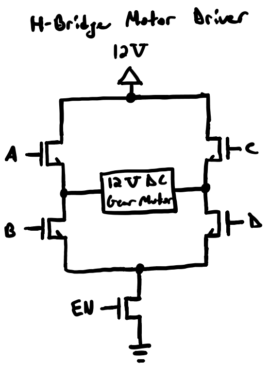

# Love's Worklog

## 02/11/2025 - First Meeting with TA
This was our first meeting with out TA, Chi Zhang. We were discussing our project proposal and a few notes from the meeting included the following:
1. Highlevel requirements should be quantifiable
2. We needed to discuss with the professor about how we should demo our project
3. Better the block diagram such that each block has specific component names and the connects are properly labeled
4. Most of the proposal should mention measurable stuff much as the delay or response time of the systems

With this information, my group and I discussed these aspects and prepared the project proposal for the final submission. 

## 02/13/2025 - Talk with Machine Shop
After emailing the professor regarding our demonstration for the final demo, Romeo and I talked with the Machine Shop to see if they had a door that was scaled down for demonstration purposes. They provided us with a door that will fit well for our project demonstration. We also discussed aspects of which motor to use to help with the Door Opener System and we were suggested a 12V DC gear motor. With this information, my group and I updated our proposal to reflect our scaled down door and determined parts based on that. 

## 02/19/2025 - Proposal Review with Professor
We presented our final proposal in front of the Professor Gruev. In terms of complexity, the professor approved the project but the group was unaware of how we were doing to drive the 12V DC gear motor. Professor Gruev told us to focus on that aspect of the project to ensure we understand what is going on. He also suggested that instead of using a voltage regulator to step down certain voltages, we should look into LDO.

## 02/22/2025-02/24/2025 - Research on H-Bridge Motor Driver and LDO
After the propsoal review, I did some research on the H-bridge motor driver and LDO. Essentially what I learned was that we should be using mosfets, specifically nMOS to control our motor spinning in the forward or reverse direction. An LDO is needed when we are stepping down a voltage by very little so since we were using a regular voltage regualtor to go from 3.6V to 3.3V in the Remote Control Power Subsystem, we should consider using an LDO. With Alex, I determined that we can use AP2112K-3.3TRG1, which works perfectly for what we were trying to achieve in that power subsystem. 

## 02/25/2025 - Meet-up with Groupmates
I met up with Romeo and we discussed how the ESP32 will connect with the H-bridge motor driver. We believe that the GPIO pins from the ESP32 should be going to the gates of the mosfets to determine if the motor will spin forward or in the reverse direction. We also looked into how the Bluetooth function of the ESP32 works. Essentially for this, the remote will act as the server while the Door Opener System should be the client which will allow the two to communicate. For the Latch System, we are still thinking if we want the remote to send a signal to it for whether the remote should send a signal to the Door Opener System which then sends a signal to the Latch System. We feel the second way will be easier but the first method might allow for a faster response time. So with that we are still considering what to do. Below is a basic drawing of what our H-bridge will look like:

We also had our weekly TA meeting where we shared the progress of our project. We wanted to discuss how the BlueTooth singals where going to work in our project because we believe that it will be suitble to go from the remote to door to latch back to door and then remote. We also breiefly discussed about getting parts and stuff for the project.

## 02/26/2025 - Remote PCB Design
I met up with Romeo to work on the PCB design for our remote control. We discussed about the layout of our PCB designs and determined that we will need three different PCB designs since each of our main subsystems have their own power system and it will be easier to communicate that way between the subsystem. We started by determining what parts will be needed for the remote PCB and started putting down the design on KiCad. We followed our block diagram in order to create the design and answered any questions that popped up as we went along designing the PCB. We are unsure of how the 7-segment display is going to connect but added a connector for it at the moment to have it ready for the PCB design review.

## 02/27/2025 - Door Latch PCB Design
I met up with Romeo again to work on our next susbsystem PCB design which is the Door Latch. We were trying to get this one done as well so that Romeo and Alex can attend the PCB review and get feedback on them. The designing did not take long as we followed the block diagram again and this seemed like the simple one out of all the other ones. We needed to figure out how to determine if the lacth was retracted or not so we decided to use an NMOS gate to control that and needed to find one that can take 3.3V for the gate input with a 12V difference between the drain and source. We also added another signal from the latch to the ESP32 so used a voltage regulator to step down the 12V signal to a 3.3V signal. Besides these changes everything else was the same. 

## 03/04/2025 - Weekly TA Meeting
Today we had an exam for a class so we were only able to attend the TA meeting and not work further on the project. During the PCB review, the TA that met with the group mentioned we needed an UART connection in order the program the PCBs so that was the topic of discussion with the TA. We did not discuss much because we did not have any progress on the project or the PCB designs. The TA informed that there may be the USB to UART bridge that we can use to program our ESP32s but wasn;t sure if the lab had anymore left so we talked about that. We discussed alittle bit more about getting parts as well. 

## 03/05/2025-03/06/2025 - Working on Design Document
In these two days, the group worked on the design document by expanding on the proposal. We also had our parts determined by the end of the second day since that needed to be included within our Design Document. We mainly discussed about the project and started finalizing the entirety of it as we worked on the document. We updated our block diagram to ensure it reflected the different changes we had in the project such as the inclusion of the H-Bridge and how the BlueTooth signals were going to work. We also complete the PCB design for our Door Opener subystem as that was the last one we had left after the PCB review. We also determined a temporary schedule for the next few weeks leading up to the final demo in order to stay on track with the project. We faced a few challenges such as whether or not our connections were right and which parts we needed exactly but we worked through it and researched regarding it to reach a final conlusion. 

## 03/07/2025 - Office Hour Meeting to Determine How to Program for the Breadboard Demo
We were having difficulty understand how we will use the ESP32 chips for the breadboard demo so Romeo and I went to office hours to determine this. The TA during that time told us that we should use the ESP32 Dev Kits for the breadboard demo and also with any programming we will due for the project since it will make our job easier for now. So we went to the supply center to purchase those and luckily we got the last two that were there. We needed two since we will need two to communicate as one will send the signal and the other will receive it and relay it to the motor driver to get the motor spinning. 

## 03/10/2025-03/11/2025 - Working on Breadboard/Breadboard Demo
These two days, we needed to work on the breadboard demo since we were busy leading up to it. The first day I worked on trying to set up the H-bridge Motor Driver since were were going to demo the motor running through BlueTooth signals. So the other teammates worked on determining how to program the ESP32 Dev Kit so that it can be used to send signals to the motor for it to start spinning in either the reverse or forward direction. With the motor driver, I was having isssues regarding floating voltages around the circuit and also had forgotten to debounce the circuit. We also didn't have batteries that were properly powering the circuit or the ESP32 Dev Kit so we had to go into lab to use the pwoer supplies there. Once we reached the lab, we figured out we needed a pull-down resistor to combat the floating voltage for the motor driver. we used a 1 M-ohm resistor and the h-bridge motor driver was finally working. Now we needed the ESP32 to be programmed so that it can connect to the motor driver. The biggest issue with this was that the datasheet given to us for the Dev Kit was wrong so we needed to determine which pins where which. This took up most of our time that day but still were were unsucessfull in getting the ESP32 to send signals to the motor driver. We were able to recieve signal from one ESP32 to our phone and also send a signal to our phone but were not able to connect the two ESP32s to send and receive signals between them. In the end, we gave up and decided we will try one last time before the demo the second day. We were still unsucessful the next day so we decided to demo the two things separetely. We had the motor driver spinning the motor in two directions using buttons and used out phones to show the ESP32s being able to send and receive signals. The demo went well as the professor said that this was sufficient and now we just needed to focus on getting the PCB designs done and submitting them for the order. 

## 03/12/2025 - Finalize PCB Designs
We needed out PCB designs to be finalized today since we needed to submit the order for it the following day. We finished the schematics and had to change our ESP32 schematic since we were using the wrong one. We had the right one first but then since we were using the ESP32 Dev Kit for the breaboard demo we thought we need to use that datasheet for our PCB so we tried to find that one and change our connections for that. But then we faced the issue of not having the footprint for it so we had to switch back to the orignal one which ended up being the right one. This wasted our time with the schematic but after that we finally moved on to transferring the schematic to the PCB. We designed the PCBs and then went on to submitting it to pass the machine audit on PCBway. Mine passed but my groupmates had to revise so we ended up finishing it the following day and getting it submitted. 

## 03/14/2025 - Talk with Machine Shop
Romeo and I went to give the machine shop our PCB dimensions and our parts such as the motor and the latch that we had ordered for the project. They needed it to start mounting it on the door. We also needed them to order the housing for the PCBs thus the PCB dimensions but they told us to come back with the PCBs when they come in since it will be easier to order the hosuing boxes when they physically have it. 
