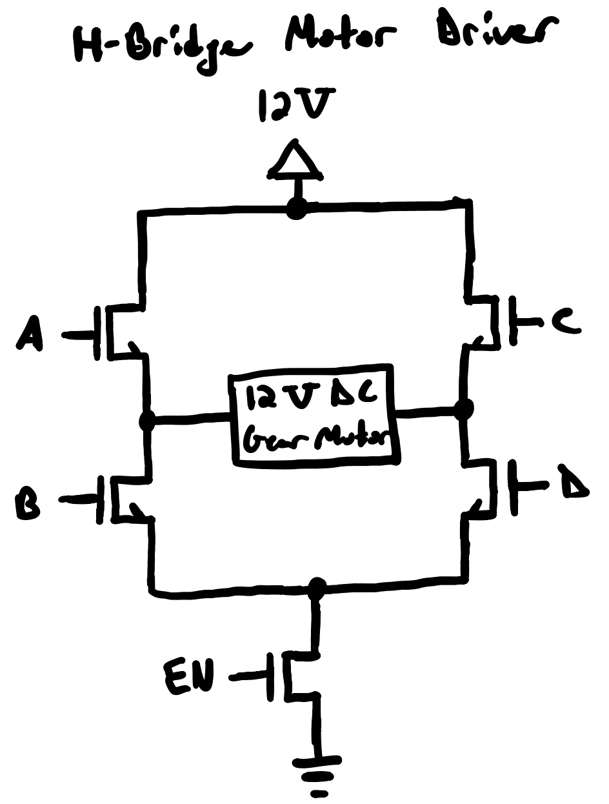

# Love's Worklog
---

## 02/11/2025 - First Meeting with TA
This was our first meeting with out TA, Chi Zhang. We were discussing our project proposal and a few notes from the meeting included the following:
1. Highlevel requirements should be quantifiable
2. We needed to discuss with the professor about how we should demo our project
3. Better the block diagram such that each block has specific component names and the connects are properly labeled
4. Most of the proposal should mention measurable stuff much as the delay or response time of the systems

With this information, my group and I discussed these aspects and prepared the project proposal for the final submission. 

## 02/13/2025 - Talk with Machine Shop
After emailing the professor regarding our demonstration for the final demo, Romeo and I talked with the Machine Shop to see if they had a door that was scaled down for demonstration purposes. They provided us with a door that will fit well for our project demonstration. We also discussed aspects of which motor to use to help with the Door Opener System and we were suggested a 12V DC gear motor. With this information, my group and I updated our proposal to reflect our scaled down door and determined parts based on that. 

## 02/19/2025 - Proposal Review with Professor
We presented our final proposal in front of the Professor Gruev. In terms of complexity, the professor approved the project but the group was unaware of how we were doing to drive the 12V DC gear motor. Professor Gruev told us to focus on that aspect of the project to ensure we understand what is going on. He also suggested that instead of using a voltage regulator to step down certain voltages, we should look into LDO.

## 02/22/2025-02/24/2025 - Research on H-Bridge Motor Driver and LDO
After the propsoal review, I did some research on the H-bridge motor driver and LDO. Essentially what I learned was that we should be using mosfets, specifically nMOS to control our motor spinning in the forward or reverse direction. An LDO is needed when we are stepping down a voltage by very little so since we were using a regular voltage regualtor to go from 3.6V to 3.3V in the Remote Control Power Subsystem, we should consider using an LDO. With Alex, I determined that we can use AP2112K-3.3TRG1, which works perfectly for what we were trying to achieve in that power subsystem. 

## 02/25/2025 - Meet-up with Groupmates
I met up with Romeo and we discussed how the ESP32 will connect with the H-bridge motor driver. We believe that the GPIO pins from the ESP32 should be going to the gates of the mosfets to determine if the motor will spin forward or in the reverse direction. We also looked into how the Bluetooth function of the ESP32 works. Essentially for this, the remote will act as the server while the Door Opener System should be the client which will allow the two to communicate. For the Latch System, we are still thinking if we want the remote to send a signal to it for whether the remote should send a signal to the Door Opener System which then sends a signal to the Latch System. We feel the second way will be easier but the first method might allow for a faster response time. So with that we are still considering what to do. Below is a basic drawing of what our H-bridge will look like:

